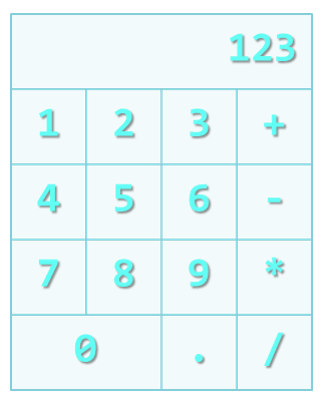

# A1 : Tables-Form-Challenge

## Requirements
1. Implement the above using HTML tables and forms.
2. Use buttons for all numbers and operators
3. The result section should be a textbox
4. Be as creative as possible :)

## NB:
- You are NOT required to use any styles
- You are NOT required to implement the functionalities
- In case you need to brush up on concepts, please refer to the Google  classroom and also the github class exercise repository.
